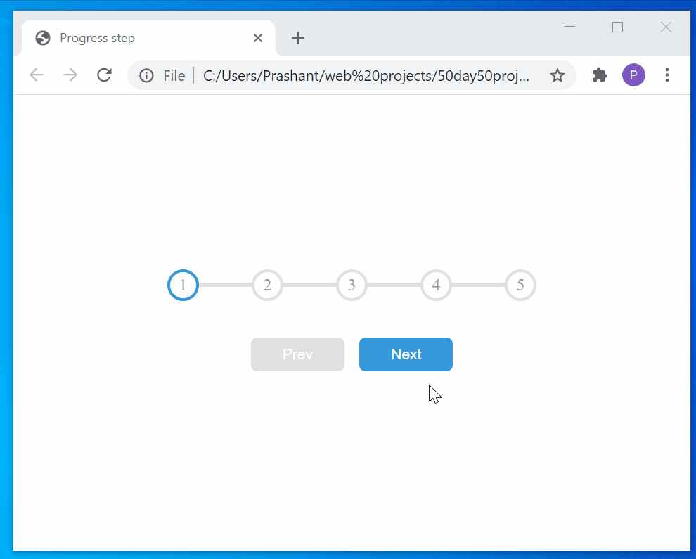

# 50day50project

Using HTML , CSS and JS to sharpen the skills
please wait till all the gifs image load to see the animations lag free

<h1>Expandable Card<h1>
<h4>Project 1</h4>

 
 
<h1>Progress steps<h1>
<h4>Project 2</h4>

 
 
<h1>Hidden Search widget<h1>
<h4>Project 3</h4>

  
 
 
<h1>Rotating Navigation<h1>
<h4>Project 4</h4>

  
 
 
<h1>Scroll Animation<h1>
<h4>Project 5</h4>

  
 
 
<h1>Split landing page<h1>
<h4>Project 6</h4>

 
 
<h1>Blurry loading page<h1>
<h4>Project 7</h4>

 
 
<h1>Form wave animation<h1>
<h4>Project 8</h4>

 
 
<h1>Sound board<h1>
<h4>Project 9</h4>

 Cannot add sounds here :(

 
 
<h1>Dad Jokes<h1>
<h4>Project 10</h4>

 using fetch api to get dad jokes

 
 
<h1>FAQ collapse<h1>
<h4>Project 12</h4>

